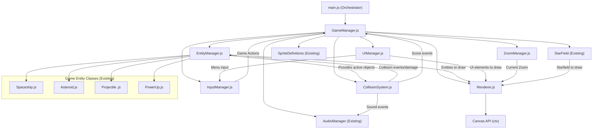

# Plan: Refactoring `main.js` into Logical Modules

**Objective**: Decouple core game logic from `main.js` by extracting functionalities into separate, cohesive modules/classes. This will improve maintainability, testability, and facilitate future enhancements like mobile input. `main.js` will become an orchestrator, initializing and connecting these modules.

## I. Proposed Modules and Their Responsibilities

1.  **`GameManager.js` (or `GameController.js`)**
    *   **Responsibilities**:
        *   Overall game state management (`GameState` enum, `currentGameState`).
        *   Game progression (waves, scoring, lives).
        *   High-level game lifecycle methods (`initGame`, `startGame`, `resetLevelAndEntities`, `pauseGame`, `resumeGame`, `gameOver`).
        *   Orchestrating updates and drawing between other modules.
        *   Managing global game variables (score, lives, currentWave, selectedPlayerSpriteName).
    *   **Key `main.js` parts to migrate**: `GameState` enum, game state variables, `resetGame()`, `initializeLevel()`, `addScore()`, player death/respawn state transition logic.

2.  **`InputManager.js`**
    *   **Responsibilities**:
        *   Abstracting input sources (keyboard, and eventually mouse/touch).
        *   Mapping raw inputs to defined game actions (e.g., "thrust", "rotateLeft", "fire", "pause", "menuConfirm").
        *   Maintaining the current state of continuous game actions (e.g., `isThrusting`).
        *   Providing an interface for other modules to query action states or subscribe to discrete action events.
    *   **Key `main.js` parts to migrate**: `keydown` and `keyup` event listeners. Logic within these will be refactored to update internal action states or dispatch events.
    *   **Mobile Focus**: This module is critical for future mobile support, allowing touch controls to be mapped to the same abstract game actions.

3.  **`Renderer.js` (or `View.js`)**
    *   **Responsibilities**:
        *   Handling all canvas drawing operations (`ctx`).
        *   Drawing the game world (entities via `EntityManager`, starfield via `StarField`).
        *   Drawing UI elements (menus, HUD via `UIManager`).
        *   Applying camera transformations (zoom via `ZoomManager`).
    *   **Key `main.js` parts to migrate**: All `ctx.*` drawing calls from `gameLoop`, including screen clearing, scaling, and calls to `starField.draw()`.

4.  **`EntityManager.js` (or `GameObjectManager.js`)**
    *   **Responsibilities**:
        *   Managing the list/collection of all active `gameObjects`.
        *   Factory methods for creating and initializing all types of game entities (player, enemies, asteroids, projectiles, power-ups) using `spriteDefinitions`.
        *   Calling the `update()` method on all active game objects.
        *   Providing access to entities for other systems (e.g., for rendering, collision detection).
    *   **Key `main.js` parts to migrate**: `gameObjects` array, entity creation logic within `initializeLevel()` and `resetGame()`, and the `gameObjects.forEach(obj => obj.update())` loop.

5.  **`CollisionSystem.js`**
    *   **Responsibilities**:
        *   Retrieving collidable entities from `EntityManager`.
        *   Performing broad-phase and narrow-phase collision detection between entity pairs.
        *   Resolving collisions based on the types of entities involved (e.g., player-vs-asteroid, projectile-vs-enemy).
        *   Applying consequences of collisions:
            *   Instructing entities to `takeDamage()`.
            *   Notifying `GameManager` to update score.
            *   Notifying `AudioManager` to play sounds.
            *   Notifying `EntityManager` to spawn new entities (e.g., asteroid fragments, power-ups).
    *   **Key `main.js` parts to migrate**: The entire `handleCollisions()` function and its internal logic.

6.  **`UIManager.js` (or `MenuManager.js`)**
    *   **Responsibilities**:
        *   Drawing all UI screens and elements (Ship Selection, Title, Pause, Player Died Choice, Game Over, HUD).
        *   Handling input specific to UI navigation (passed from `InputManager` or queried).
        *   Managing UI-specific state (e.g., `currentShipSelectionIndex`).
    *   **Key `main.js` parts to migrate**: Drawing and input logic within `gameLoop` and `keydown` listeners related to `SHIP_SELECTION`, `TITLE_SCREEN`, `PLAYER_DIED_CHOICE`, `GAME_OVER`, `PAUSED` states, and HUD display.

7.  **`ZoomManager.js`**
    *   **Responsibilities**:
        *   Managing `actualZoomLevel` and `currentTargetZoom`.
        *   Implementing `determineTargetZoomLevel()` logic based on game situation.
        *   Providing the current `actualZoomLevel` to the `Renderer`.
    *   **Key `main.js` parts to migrate**: `ZOOM_LEVELS` constants, zoom-related state variables, `determineTargetZoomLevel()`, and `lerp()` function (if not made a general utility).

**Existing Modules to be Integrated:**
*   **`AudioManager.js`**: Will be instantiated by `GameManager` and passed to systems that need to trigger sounds (e.g., `CollisionSystem`, `InputManager` for UI sounds, `GameManager` for game state sounds).
*   **`StarField.js`**: Will likely be instantiated by `GameManager` and passed to `Renderer` for drawing and updating.
*   **`Sprites.js`**: Will be instantiated by `GameManager` and passed to `EntityManager` (for entity creation) and `UIManager` (for ship selection display).

## II. Conceptual Module APIs

(A brief outline of key methods and properties for each new module)

**1. `GameManager.js`**
   *   Props: `currentGameState`, `score`, `lives`, `currentWave`, `selectedPlayerSpriteName`, `isGameOver`
   *   `constructor(entityManager, inputManager, uiManager, renderer, collisionSystem, audioManager, zoomManager, spriteDefinitions, canvas)`
   *   Methods: `initGame()`, `startGame(selectedShipName)`, `resetLevelAndEntities()`, `nextWave()`, `update(deltaTime)`, `draw()`, `addScore(points)`, `playerLosesLife()`, `respawnPlayer()`, `pause()`, `resume()`, `endGame()`, `getCurrentState()`, `getPlayerShip()`

**2. `InputManager.js`**
   *   Props: (Internal action states)
   *   `constructor(canvasElement)`
   *   Methods: `init()`, `update()`, `isActionActive(actionName: string): boolean`, `getActionValue(actionName: string): any`, `on(eventName: string, callback: Function)`, `destroy()`
   *   Game Actions: `'thrust'`, `'rotateLeft'`, `'rotateRight'`, `'fire'`, `'pause'`, `'mute'`, `'menuUp'`, `'menuDown'`, `'menuConfirm'` etc.

**3. `Renderer.js`**
   *   `constructor(canvasContext, starField)`
   *   Methods: `render(gameManager, entityManager, uiManager, zoomManager)` (gets entities, UI state, zoom, and draws everything)

**4. `EntityManager.js`**
   *   Props: `gameObjects: Array<GameObject>`, `playerShip: Spaceship`
   *   `constructor(spriteDefinitions, canvas, ctx, audioManager)`
   *   Methods: `updateAll(deltaTime, zoomLevel)`, `getEntities()`, `getCollidableEntities()`, `getPlayerShip()`, `setPlayerShip(ship)`, `addEntity(entity)`, `removeEntity(entity)`, `spawnPlayer(selectedShipName)`, `spawnEnemy(spriteName, target)`, `spawnAsteroid(typeName, x, y)`, `spawnProjectile(owner, weaponType)`, `spawnPowerUp(type, x, y)`, `spawnWaveEntities(waveNum, player)`, `clearAllExceptPlayer()`, `clearAll()`

**5. `CollisionSystem.js`**
   *   `constructor(entityManager, gameManager, audioManager)`
   *   Methods: `checkAndResolveCollisions()`

**6. `UIManager.js`**
   *   `constructor(canvas, shipsImage, audioManager)`
   *   Methods: `update(inputManager, gameManager)`, `drawCurrentUI(ctx, gameManager)`, `drawShipSelection(ctx, gameManager)`, `drawTitleScreen(ctx)`, etc. for each UI state.

**7. `ZoomManager.js`**
   *   Props: `actualZoomLevel`, `currentTargetZoom`
   *   `constructor(canvas, initialZoom)`
   *   Methods: `update(deltaTime, playerShip, allGameObjects)`, `determineTargetZoomLevel(playerShip, allGameObjects)`, `getActualZoom()`, `setTargetZoom(zoomLevelName)`

## III. High-Level Refactoring Steps

1.  **Create Files**: Create `.js` files for `GameManager`, `InputManager`, `Renderer`, `EntityManager`, `CollisionSystem`, `UIManager`, `ZoomManager`.
2.  **Define Classes**: Basic class structure in each.
3.  **Migrate Core State & Logic**:
    *   Move `GameState` enum, global game variables (`score`, `lives`, etc.) to `GameManager`.
    *   Move `gameObjects` array to `EntityManager`.
    *   Move input event listeners and action mapping to `InputManager`.
    *   Move `handleCollisions` to `CollisionSystem`.
    *   Move UI drawing and state-specific input logic to `UIManager`.
    *   Move zoom variables and `determineTargetZoomLevel` to `ZoomManager`.
    *   Move canvas drawing primitives to `Renderer`.
4.  **Refactor `main.js`**:
    *   Instantiate all manager classes.
    *   Inject dependencies (e.g., pass `EntityManager` to `GameManager`).
    *   Simplify `gameLoop` to call `gameManager.update()` and `gameManager.draw()`.
5.  **Iterative Refinement**: Test and refine interactions between modules. Start with one module (e.g., `InputManager`), get it working, then integrate the next.

## IV. Mermaid Diagram (Updated Module Interaction)

This plan should provide a solid roadmap for the refactoring effort.