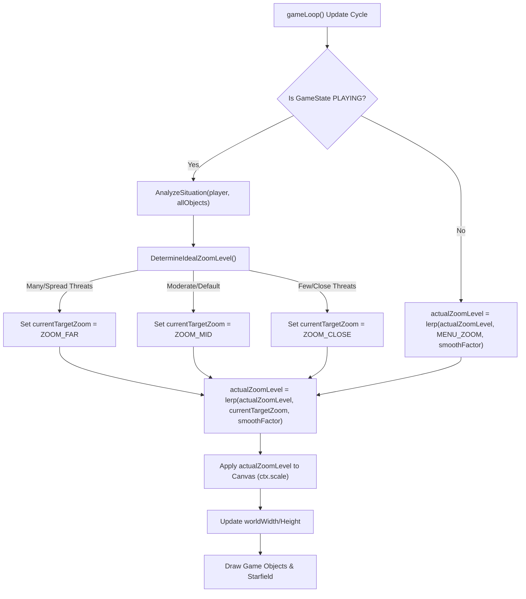

# Plan: Starfield and Zoom Enhancements

This plan details the steps to refine the starfield background for a richer visual experience and to implement a more dynamic and intuitive zoom system.

## I. Refine Starfield Background (3 Layers: Distant Stars, Nearer Stars, Nebula Clouds)

*   **Objective**: Create a visually rich starfield with a strong sense of depth using three distinct layers, including subtle nebula clouds. Stars and nebula elements will scale with zoom.
*   **File to Modify**: `games/asteroids/js/star-field.js`
*   **Detailed Changes**:
    1.  **Element Layer Definitions**:
        *   The `StarField` class will manage an array of layer configurations. Each configuration will define the properties for elements within that layer.
        *   **Layer 1 (Distant Stars)**:
            *   `elementType`: 'star'
            *   `numElements`: ~150-200 stars
            *   `sizeRange`: [0.3, 0.8] (world units)
            *   `colorPattern`: `rgba(200, 200, 255, %alpha%)` (pale blueish tint)
            *   `alphaRange`: [0.2, 0.6] (fainter)
            *   `parallaxFactor`: ~0.15 (scrolls very slowly)
        *   **Layer 2 (Nearer Stars)**:
            *   `elementType`: 'star'
            *   `numElements`: ~50-75 stars
            *   `sizeRange`: [0.7, 1.5] (world units)
            *   `colorPattern`: `rgba(255, 255, 255, %alpha%)` (brighter white)
            *   `alphaRange`: [0.5, 0.9]
            *   `parallaxFactor`: ~0.4 (scrolls moderately)
        *   **Layer 3 (Nebula Clouds)**:
            *   `elementType`: 'nebula'
            *   `numElements`: ~5-10 large cloud elements
            *   `sizeRange`: [100, 300] (world units - large, diffuse shapes)
            *   `colorOptions`: Array of soft nebula colors (e.g., `['rgba(100, 50, 150, %alpha%)', 'rgba(50, 100, 130, %alpha%)']`) - a color picked randomly per cloud.
            *   `alphaRange`: [0.05, 0.15] (very subtle and translucent)
            *   `parallaxFactor`: ~0.1 (scrolls extremely slowly)
    2.  **`StarField` Class Modifications**:
        *   `constructor`: Initialize data structures to hold elements for each layer.
        *   `initBackgroundElements(zoomLevel)` (rename from `initStars`):
            *   Iterate through layer configurations.
            *   For each layer, generate its elements (`stars` or `nebulae`) based on its specific configuration (`numElements`, `sizeRange`, `colorPattern`/`colorOptions`, `alphaRange`). Store these in per-layer arrays or a single array with layer identifiers.
            *   Distribute elements across an `initialWorldWidth` and `initialWorldHeight` (calculated based on `zoomLevel`).
        *   `update(deltaTime, gameZoomLevel)`:
            *   Iterate through each layer of elements.
            *   Update element positions based on their layer's `parallaxFactor` and `deltaTime`. Elements wrap around the world boundaries.
        *   `draw()`:
            *   Iterate through layers, drawing from back (nebula) to front (nearer stars).
            *   For 'star' elements: Draw as circles with their stored color and alpha.
            *   For 'nebula' elements:
                *   Draw as large, soft, translucent filled shapes (e.g., multiple overlapping circles with low alpha, or a single large circle with a radial gradient if feasible).
                *   Consider `ctx.globalCompositeOperation = 'lighter'` for a nice blending effect if performance allows.

## II. Redo Zoom Levels & Logic (Dynamic Aiming for 3 Target Levels)

*   **Objective**: Implement a dynamic zoom system that smoothly transitions between three predefined target zoom levels based on the game action, primarily focusing on keeping the player and key threats in view.
*   **File to Modify**: `games/asteroids/js/main.js`
*   **Detailed Changes**:
    1.  **Define Target Zoom Levels (Constants)**:
        *   `ZOOM_CLOSE`: e.g., 0.8 (Player-focused view)
        *   `ZOOM_MID`: e.g., 0.5 (Default gameplay view)
        *   `ZOOM_FAR`: e.g., 0.25 (Wider tactical view)
    2.  **State Variables for Zoom**:
        *   `actualZoomLevel`: The zoom level currently applied to the canvas context (interpolated). Initialize to `ZOOM_MID`.
        *   `currentTargetZoom`: The zoom level the game logic has decided is ideal for the current situation. Initialize to `ZOOM_MID`.
        *   `zoomSmoothFactor`: A small value (e.g., 0.05) for lerping.
    3.  **`determineTargetZoomLevel()` Function**:
        *   This new function will be called each frame in `gameLoop` (during `PLAYING` state).
        *   **Inputs**: `playerShip`, `gameObjects` array.
        *   **Logic**:
            *   Identify active enemies.
            *   If no enemies or only very distant enemies: `currentTargetZoom = ZOOM_MID` (or `ZOOM_CLOSE` if player is idle and alone).
            *   If enemies are present:
                *   Calculate a bounding box encompassing `playerShip` and a few (e.g., 1-3) "most relevant" enemies (closest, or those posing an immediate threat).
                *   Alternatively, consider the distance to the furthest significant enemy or the general spread of enemies.
                *   If action is tight and focused (e.g., player vs. one close enemy): `currentTargetZoom = ZOOM_CLOSE`.
                *   If multiple enemies are spread out or a significant threat is further away: `currentTargetZoom = ZOOM_FAR`.
                *   Otherwise (moderate engagement): `currentTargetZoom = ZOOM_MID`.
            *   Consider asteroid density as a secondary factor: if the field is very dense around the player, it might slightly favor `ZOOM_MID` over `ZOOM_CLOSE`.
        *   **Return**: One of `ZOOM_CLOSE`, `ZOOM_MID`, `ZOOM_FAR`.
    4.  **Update `gameLoop()`**:
        *   If `currentGameState === GameState.PLAYING`:
            *   `currentTargetZoom = determineTargetZoomLevel();`
            *   `actualZoomLevel = lerp(actualZoomLevel, currentTargetZoom, zoomSmoothFactor);` (where `lerp(start, end, amt)` is `start + (end - start) * amt`).
        *   Else (for menus, etc.): `actualZoomLevel = lerp(actualZoomLevel, 1.0, zoomSmoothFactor);` (or a fixed menu zoom).
        *   Update `worldWidth` and `worldHeight` based on `actualZoomLevel`.
        *   Use `actualZoomLevel` for `ctx.scale()`.
        *   Pass `actualZoomLevel` to `starField.update()` and `starField.draw()` (if starfield needs to know the applied zoom for any internal calculations, though drawing is on an already-scaled context).
    5.  **Initial Zoom**:
        *   In `resetGame()` or when transitioning to `PLAYING` for the first time, set `actualZoomLevel` and `currentTargetZoom` to `ZOOM_MID`.
        *   The `starField.setZoomLevel()` call in `main.js` (currently line 30) should be reviewed. `starField.initBackgroundElements()` should ideally be called with a representative zoom level, or its star density logic made less dependent on a single initial zoom if the game zoom changes significantly.

## III. Mermaid Diagrams

### Starfield Rendering Order

```mermaid
graph TD
    subgraph StarfieldDrawingProcess
        direction LR
        L3[Draw Layer 3: Nebula Clouds] --> L1[Draw Layer 1: Distant Stars];
        L1 --> L2[Draw Layer 2: Nearer Stars];
    end
    GL[Game Loop] -->|Calls starfield.draw()| L3;
    L2 --> SD[Starfield Fully Drawn on Canvas];
```

### Refined Zoom Logic Flow



This plan provides a comprehensive approach to enhancing both the starfield visuals and the game's dynamic zoom behavior.